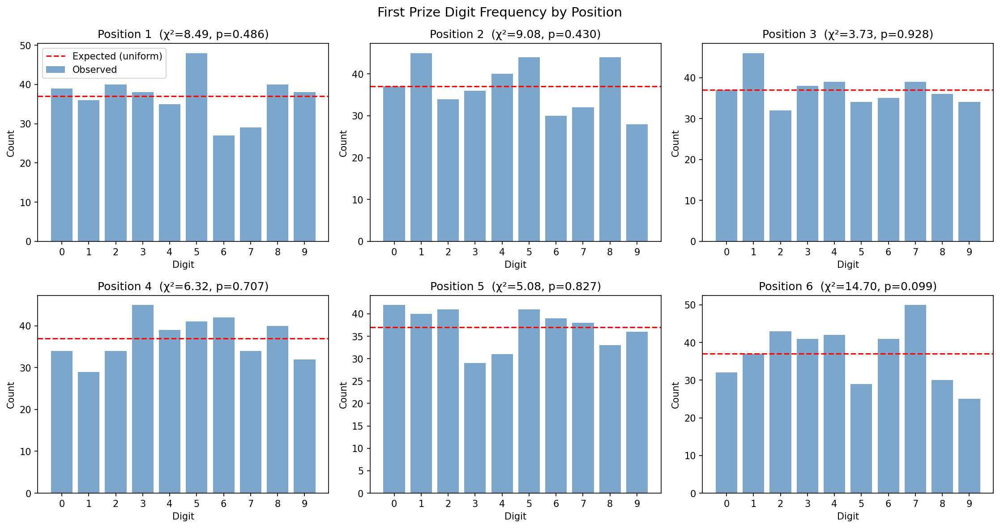
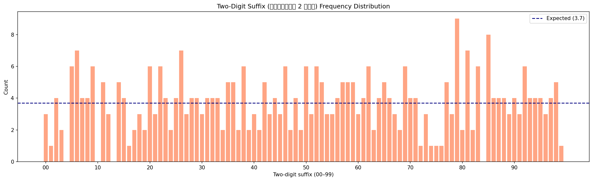
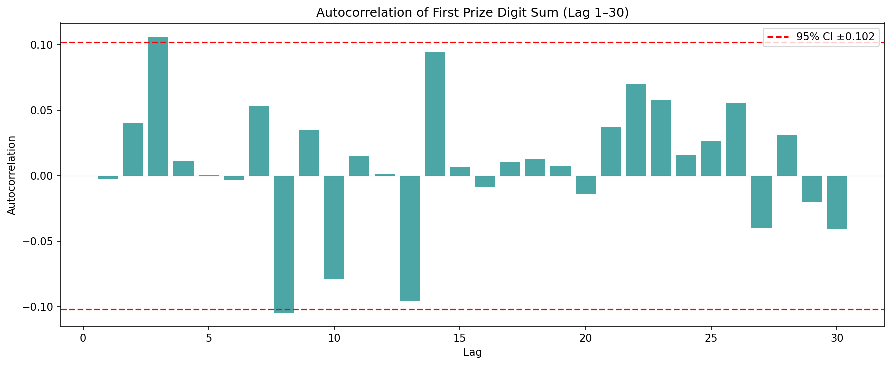

# Phase 1 EDA Report — Project Fortuna

> Generated from 370 draws
> Date range: 2006-12-30 to 2026-04-16
> Approximate span: 14.2 years (based on draw count)

---

## Honest framing

**If signal exists it should appear here.** This analysis tests whether
Thai Government Lottery draws deviate from uniform random. The null
hypothesis is uniformity. Most results are expected to show p > 0.05
(fail to reject H0), confirming the lottery operates as designed.
Any p < 0.05 finding here is a statistical anomaly that warrants
Phase 2 investigation — not a claim of actionable edge.

---

## 1. Data Summary

| Metric | Value |
|--------|-------|
| Total draws | 370 |
| First draw | 2006-12-30 |
| Last draw | 2026-04-16 |
| Missing draw_id duplicates | 0 (dedup enforced by store) |

---

## 2. First Prize — Digit Position Frequency

Chi-square uniformity test per digit position (H0: each digit 0–9 equally likely):

| Position | n | χ² | p-value | Reject H0 (p<0.05)? |
|----------|---|----|---------|---------------------|
| 1 | 370 | 8.49 | 0.4860 | No |
| 2 | 370 | 9.08 | 0.4298 | No |
| 3 | 370 | 3.73 | 0.9283 | No |
| 4 | 370 | 6.32 | 0.7071 | No |
| 5 | 370 | 5.08 | 0.8272 | No |
| 6 | 370 | 14.70 | 0.0994 | No |

**Interpretation:** p > 0.05 on most/all positions = lottery looks uniform
(expected). Any position with p < 0.05 is an anomaly worth investigating
in Phase 2 — but requires BH-FDR correction across all tests before claiming
significance (SPEC §7.2).

---

## 3. Two-Digit Suffix Distribution

Chi-square uniformity test on เลขท้าย 2 ตัว (00–99):
  χ² = 86.76, p = 0.8053, n = 370
  Reject H0: No

---

## 4. Autocorrelation of Digit Sums

95% confidence bounds: ±0.1019

Lags outside the confidence band suggest non-random serial dependence.

| Lag | ACF | Outside 95% CI? |
|-----|-----|-----------------|
| 1 | -0.0025 | No |
| 2 | 0.0406 | No |
| 3 | 0.1062 | YES |
| 4 | 0.0110 | No |
| 5 | 0.0003 | No |
| 6 | -0.0034 | No |
| 7 | 0.0534 | No |
| 8 | -0.1045 | YES |
| 9 | 0.0352 | No |
| 10 | -0.0785 | No |
| 11 | 0.0152 | No |
| 12 | 0.0010 | No |
| 13 | -0.0956 | No |
| 14 | 0.0944 | No |
| 15 | 0.0070 | No |
| 16 | -0.0088 | No |
| 17 | 0.0107 | No |
| 18 | 0.0126 | No |
| 19 | 0.0075 | No |
| 20 | -0.0143 | No |
| 21 | 0.0372 | No |
| 22 | 0.0703 | No |
| 23 | 0.0581 | No |
| 24 | 0.0159 | No |
| 25 | 0.0264 | No |
| 26 | 0.0559 | No |
| 27 | -0.0402 | No |
| 28 | 0.0310 | No |
| 29 | -0.0202 | No |
| 30 | -0.0407 | No |

---

## 5. Runs Test

Test whether the sequence of above/below-median digit sums is random.

| Metric | Value |
|--------|-------|
| n (draws) | 370 |
| n above median | 204 |
| n below median | 166 |
| Observed runs | 180 |
| Expected runs | 184.05 |
| Z-statistic | -0.4260 |
| p-value (two-sided) | 0.6701 |
| Reject H0 (p<0.05)? | No |

---

## 6. Summary

| Test | Result | Interpretation |
|------|--------|----------------|
| Digit position χ² (6 positions) | Fail to reject H0 | Looks uniform (expected) |
| Two-digit suffix χ² | Fail to reject H0 | Suffix looks uniform (expected) |
| Runs test | Fail to reject H0 | No serial pattern (expected) |

**Note:** Multiple comparisons problem applies across all tests above. No single
rejection here constitutes evidence of edge. BH-FDR correction (SPEC §7.2) is
required before any statistical claim. This EDA is exploratory only.

---

_Report generated by scripts/eda.py — Project Fortuna Phase 1_